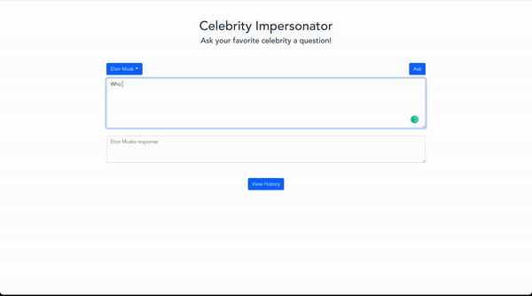

# Celebrity Impersonator
Choose from preselected celebrities or pick one of your own.
## Ask questions to your favorite celebrity

Ask any question you can think of. This application uses the GPT3 text-curie-001 completions AI to answer questions while posing as the selected celebrity

## Technologies

- Uses Vite + Vue3 to create a SPA capable of delivering an enjoyable user experience.
- GPT3 text-curie-001 completions is used for the AI

## Getting Started

- Download repo
- Sign up for OpenAI beta to obtain API key
- In the directory's root, create a .env file
- In the .env file, add: VITE_OPENAI_SECRET=yourkeyhere
- run ```npm install```, ```npm run dev```
- Click the link and ask away!

## Demo



## Features

- History is saved to local storage
- Preset celebs and custom celeb entry
